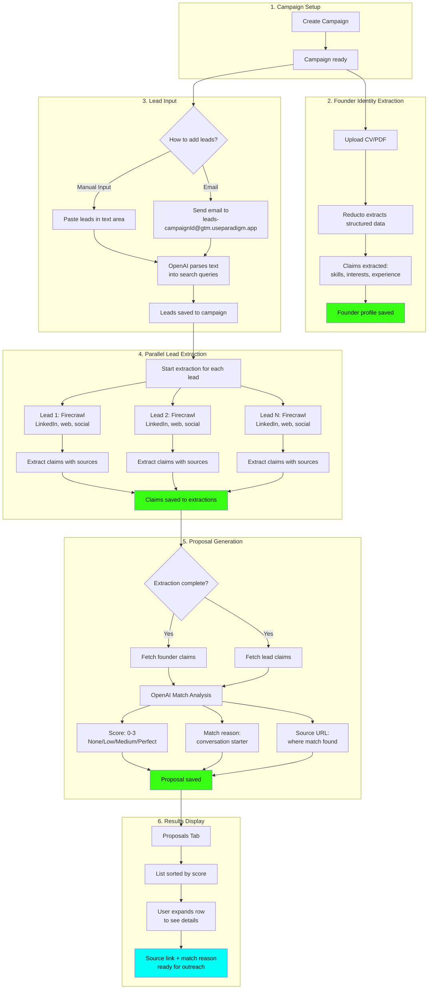
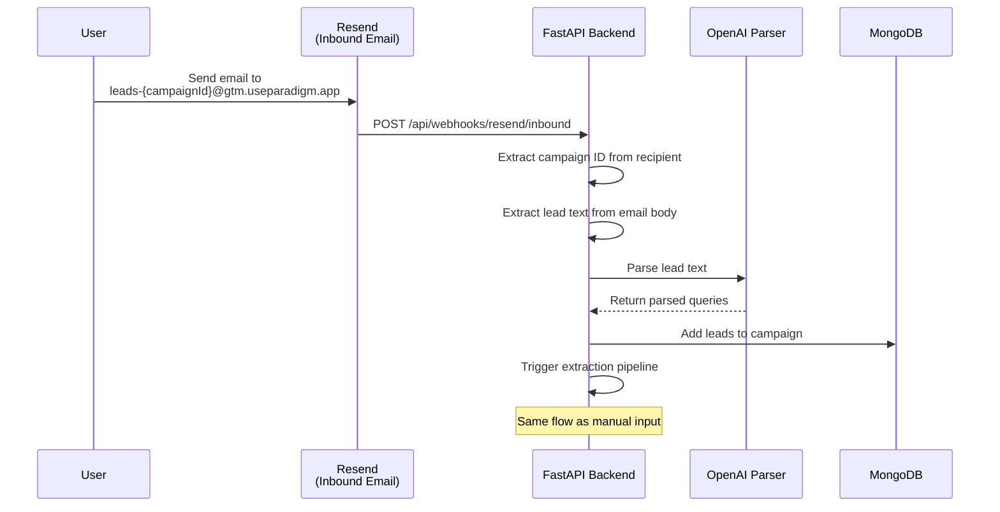
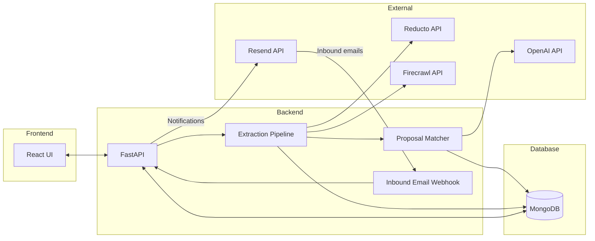

# Proposals Flow: From Lead to Personalized Outreach

This document describes how VibeGTM processes leads and generates match proposals for personalized outreach.

## Overview

VibeGTM enriches leads by finding meaningful connections between a founder and their prospects. The system discovers **Technical Fit** (shared tools/technologies) and **Personal Fit** (common hobbies/interests) to enable authentic cold outreach.

---

## The Complete Flow



---

## Step-by-Step Process

### 1. Campaign Setup

A campaign is the container for all your outreach efforts. It holds:
- Your founder identity profile
- Your list of leads
- Generated proposals for each lead

### 2. Founder Identity Extraction

Before the system can find matches, it needs to understand who YOU are.

**How it works:**
1. Upload your CV or professional PDF document
2. The backend sends the PDF to **Reducto** for structured extraction
3. Reducto returns structured data including:
   - Professional experience and skills
   - Personal interests and hobbies
   - Education and certifications
   - Languages and publications
4. These become your "claims" - facts about you that can match with leads

**Example claims extracted:**
- "Rides a Harley Davidson motorcycle"
- "Expert in TypeScript and React"
- "Based in San Francisco"
- "Former YC founder"

### 3. Lead Input

Leads can be added in two ways:

#### Option A: Manual Input (Leads Tab)
1. Paste your lead list in any format (CSV, bullet points, plain text)
2. Click "Parse Leads"
3. OpenAI intelligently parses and cleans the text into search queries

**Example input:**
```
- Joshua Alphonse - Mux Community Engineer
- Ernie Ho, Namecard.ai CEO
John Smith Acme Corp
```

**Parsed output:**
- Joshua Alphonse Mux Community Engineer
- Ernie Ho Namecard.ai CEO
- John Smith Acme Corp

#### Option B: Email Integration
Send an email with leads to:
```
leads-{campaignId}@gtm.useparadigm.app
```

The system automatically:
1. **Resend** receives the inbound email via webhook
2. Extracts lead information from the email body
3. Parses it just like manual input
4. Adds leads to the specified campaign
5. Starts processing immediately

### 4. Parallel Lead Extraction

Once leads are parsed, enrichment begins automatically and in parallel.

**For each lead:**
1. **Firecrawl** crawls available sources:
   - LinkedIn profile and posts
   - Company website (/about, /jobs, /blog pages)
   - Personal blogs or social media
2. AI extracts structured claims from the crawled content
3. Each claim includes its source URL for verification

**Example claims extracted from a lead:**
- "Documented cross-country motorcycle journey on Harley" (source: Medium)
- "Previously worked at Stripe on payments infrastructure" (source: LinkedIn)
- "Speaks fluent Spanish" (source: personal blog)

### 5. Proposal Generation

When a lead's extraction completes, proposal generation triggers automatically.

**The matching process:**
1. Fetch all founder claims from the campaign
2. Fetch all lead claims from the extraction
3. Send both to OpenAI with a specialized matching prompt

**OpenAI analyzes for:**
- Shared hobbies (both ride motorcycles, play tennis)
- Common experiences (same school, previous employer)
- Mutual interests (AI, startup culture, specific technologies)
- Cultural/community overlap (same communities, events)

**Output for each proposal:**

| Field | Description | Example |
|-------|-------------|---------|
| **Score** | 0=None, 1=Low, 2=Medium, 3=Perfect | 3 (Perfect) |
| **Reason** | Conversational match explanation | "You both ride Harleys and have done cross-country trips" |
| **Source URL** | Where the lead's matching claim was found | medium.com/@jalphonse/my-harley-adventure |

### 6. Results Display (Proposals Tab)

The Proposals tab shows all generated proposals sorted by score.

**List view:**
```
▸ Joshua Alphonse     [PERFECT]  ████████████
▸ Ernie Ho            [MEDIUM]   ████████░░░░
▸ Joe Schwarzmann     [LOW]      ████░░░░░░░░
▸ Jane Doe            [NONE]     ░░░░░░░░░░░░
```

**Expanded view (click a row):**
```
▾ Joshua Alphonse     [PERFECT]  ████████████
  ┌─────────────────────────────────────────
  │ > MATCH: You both ride Harleys and have
  │          done cross-country trips
  │ > SOURCE: Medium (medium.com/@jalphonse...)
  └─────────────────────────────────────────
```

**Score badge colors:**
- **Perfect (3)**: Neon green - strong overlap, clear conversation potential
- **Medium (2)**: Amber - meaningful shared interest worth mentioning
- **Low (1)**: Dimmed cyan - tenuous connection, not compelling
- **None (0)**: Gray - no relevant overlap found

---

## Email-to-Lead Integration

The email integration provides a convenient way to add leads without opening the app.



**Usage:**
1. Find your campaign ID (visible in the URL or settings)
2. Send an email to `leads-{campaignId}@gtm.useparadigm.app`
3. Include your leads in the email body (any format)
4. Leads are automatically added and processing begins

---

## Data Flow Summary

| Stage | Input | Processing | Output |
|-------|-------|------------|--------|
| Identity | PDF document | Reducto extraction | Founder claims |
| Lead Input | Raw text / Email (via Resend) | OpenAI parsing | Search queries |
| Extraction | Search query | Firecrawl + AI | Lead claims with sources |
| Matching | Founder + Lead claims | OpenAI analysis | Scored proposal |
| Notification | Batch complete | Resend email | User notified |
| Display | Proposals | Sort by score | Ranked list for outreach |

---

## Technical Architecture



**External Services:**
- **Reducto** - PDF parsing for founder identity extraction
- **Firecrawl** - Web scraping for LinkedIn, company sites, social profiles
- **OpenAI** - Lead parsing and proposal matching analysis
- **Resend** - Inbound email processing + completion notifications

**Collections:**
- `campaigns` - Campaign metadata and lead list
- `extractions` - Raw extraction results with claims
- `proposals` - Match analysis results

---

## Why Source Attribution Matters

Firecrawl is powerful but can occasionally hallucinate or misattribute information. Every match includes a source URL so users can:

1. **Verify** the match is accurate before reaching out
2. **Reference** the specific content in their outreach
3. **Build trust** by showing they've done their research

**Example email opener using a match:**
> "I noticed you also ride Harleys - I saw your post on Medium about the cross-country trip. I did Route 66 last summer and would love to compare notes!"

The source link (`medium.com/@jalphonse/my-harley-adventure`) lets the founder verify this is real before sending.
