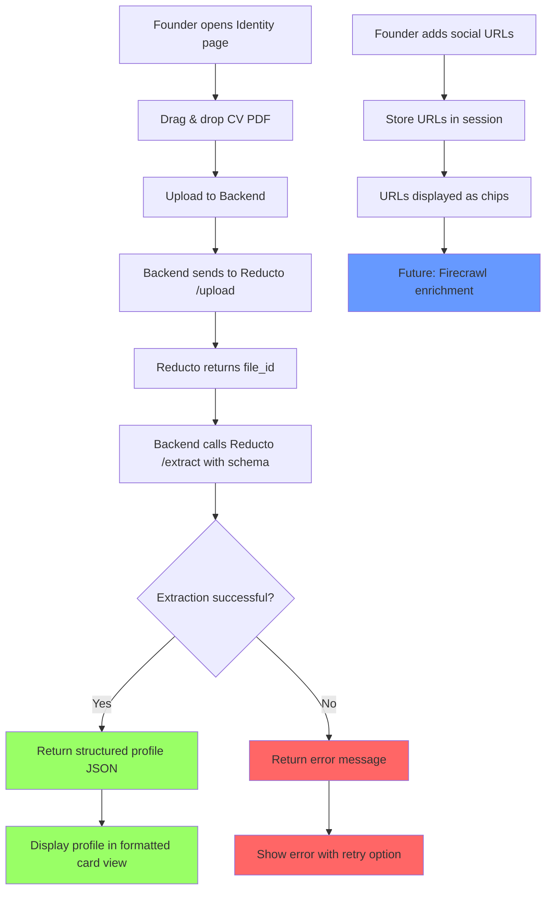

# User Story: Identity Injection (Founder Profile)

**Story ID**: GTM-1
**Created**: 2026-01-31

## User Persona

A startup founder preparing to do personalized outreach who needs to build their "identity profile" so the system can find matches with prospects.

## Feature Statement

As a founder,
I want to upload my CV and provide my social URLs
so that the system can extract a structured profile about me for lead matching.

## Flow Diagram



## Narrative

### Overview

Identity Injection is the first step in the VibeGTM workflow. Before the system can find "vibes" (personal connections) between a founder and their prospects, it needs to understand who the founder is. This story covers building the founder's identity profile from their CV.

### User Flow

1. **Upload CV**: Founder navigates to the Identity/Profile page and sees a drag-and-drop zone. They drop their CV PDF file.

2. **Processing**: The frontend uploads the file to the backend. The backend:
   - Sends the PDF to Reducto's `/upload` endpoint
   - Calls Reducto's `/extract` endpoint with the predefined founder profile schema
   - Returns the structured JSON to the frontend

3. **Display Profile**: The extracted profile appears in a formatted card view showing:
   - Professional summary
   - Work experience timeline
   - Skills as badges
   - Interests as tags (key for "vibe" matching)
   - Education, certifications, languages
   - URLs extracted from the CV

4. **Add Social URLs** (for future enrichment): Below the extracted profile, the founder can add URLs to their social profiles (LinkedIn, Instagram, X.com). These are stored but not yet processed - Firecrawl integration is out of scope for this story.

### Business Rules

- Only PDF files are accepted for CV upload
- Maximum file size: 10MB
- The Reducto schema extracts all available fields, but missing data returns empty arrays (not errors)
- URLs added manually are stored in the session/profile for future Firecrawl enrichment

### Reducto Schema

The extraction uses a comprehensive schema covering:
- `summary` - Brief professional summary
- `professionalExperience[]` - Job history with titles, companies, dates, responsibilities
- `projects[]` - Notable projects with tech stack
- `skills[]` - Skills with proficiency levels (beginner/intermediate/advanced/expert)
- `interests[]` - Personal interests (critical for vibe matching)
- `education[]` - Degrees and institutions
- `courses[]` - Completed courses
- `certificates[]` - Professional certifications
- `publications[]` - Published works
- `spokenLanguages[]` - Languages with proficiency
- `urls[]` - Social/professional URLs found in CV

### Out of Scope (Future Stories)

- **GTM-1.1**: Firecrawl integration to enrich profile from social URLs
- **GTM-1.2**: Store profile in MongoDB for persistence
- **GTM-1.3**: Edit/refine extracted profile manually

## Non-functional Requirements

### Loading & Feedback

- Show upload progress indicator while file transfers to backend
- Show "Extracting profile..." spinner during Reducto processing (typically 3-10 seconds)
- Profile card should render progressively as sections are populated

### Error Handling

- Invalid file type: "Please upload a PDF file"
- File too large: "File exceeds 10MB limit"
- Reducto API error: "Could not process CV. Please try again."
- Network error: "Connection failed. Check your internet and retry."

### Reliability

- If Reducto extraction partially fails, show whatever was extracted with a note about missing sections
- Retry button available on any error state

## Acceptance Criteria

### Scenario: Founder uploads CV and sees extracted profile

```gherkin
Given I am on the Identity page
And I have a PDF CV file
When I drag and drop my CV into the upload zone
Then I should see an upload progress indicator
And then I should see "Extracting profile..." message
And then I should see my extracted profile displayed as a formatted card
And the card should show my professional summary
And the card should show my work experience
And the card should show my skills as badges
And the card should show my interests as tags
```

### Scenario: Founder uploads invalid file type

```gherkin
Given I am on the Identity page
When I drag and drop a .docx file into the upload zone
Then I should see an error message "Please upload a PDF file"
And no upload should be attempted
```

### Scenario: Founder uploads file exceeding size limit

```gherkin
Given I am on the Identity page
When I drag and drop a PDF file larger than 10MB
Then I should see an error message "File exceeds 10MB limit"
And no upload should be attempted
```

### Scenario: Reducto extraction fails

```gherkin
Given I am on the Identity page
And the Reducto API is unavailable
When I upload my CV PDF
Then I should see an error message "Could not process CV. Please try again."
And I should see a "Retry" button
When I click "Retry"
Then the upload and extraction should be attempted again
```

### Scenario: Founder adds social URLs for future enrichment

```gherkin
Given I am on the Identity page
And I have an extracted profile displayed
When I enter "https://linkedin.com/in/myprofile" in the LinkedIn URL field
And I enter "https://instagram.com/myhandle" in the Instagram URL field
Then the URLs should be displayed as chips below the input fields
And the URLs should be stored in my session
And I should see a note "Social enrichment coming soon"
```

### Scenario: CV has missing sections

```gherkin
Given I am on the Identity page
And my CV does not contain a publications section
When I upload my CV PDF
Then my profile should be extracted successfully
And the publications section should show "No publications found"
And all other available sections should display normally
```

## Technical Notes

### API Endpoints

**POST /api/identity/upload**
- Accepts: multipart/form-data with PDF file
- Returns: Extracted profile JSON

### Reducto Integration

```python
# Backend flow
upload_response = reducto_client.upload(file=pdf_bytes)
result = reducto_client.extract.run(
    input=upload_response,
    instructions={"schema": FOUNDER_PROFILE_SCHEMA},
    settings={"citations": {"enabled": True}}
)
return result.result
```

### Frontend Components

- `IdentityPage` - Main page container
- `CVDropZone` - Drag and drop upload component
- `ProfileCard` - Formatted display of extracted profile
- `URLInputs` - Simple text inputs for social URLs
- `URLChips` - Display added URLs as dismissible chips
