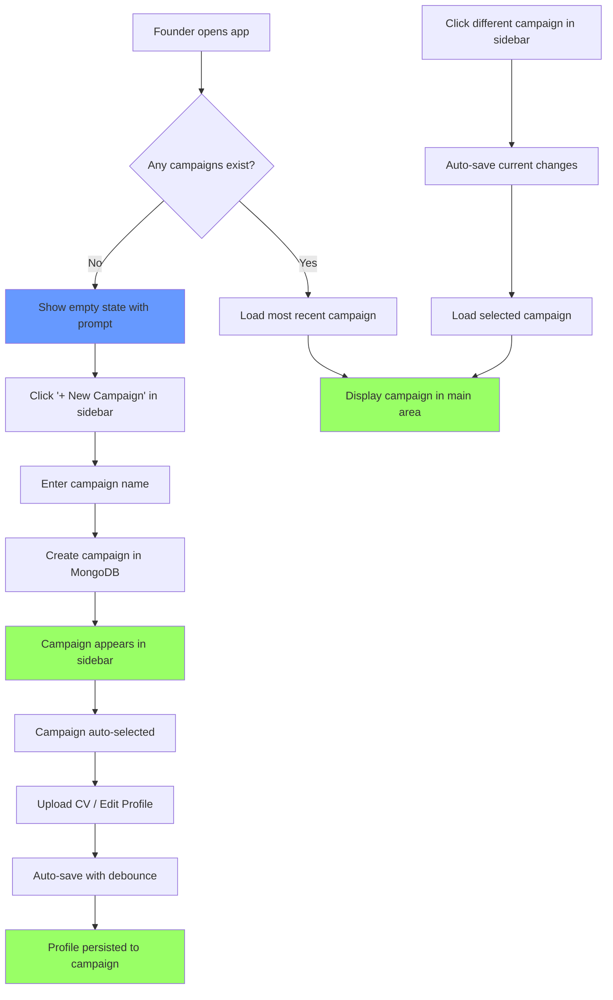

# User Story: Campaign Sidebar & Profile Persistence

**Story ID**: GTM-1.2
**Created**: 2026-01-31

## User Persona

A startup founder who needs to organize multiple outreach initiatives (e.g., "Hackathon Judges", "SF Series A Founders") and persist their identity profile per campaign for lead matching.

## Feature Statement

As a founder,
I want to create campaigns and save my extracted profile to each campaign
so that I can organize different outreach efforts and quickly switch between them during demos.

## Flow Diagram



## Narrative

### Overview

This story introduces the campaign concept as the primary organizational unit in VibeGTM. A campaign represents a distinct outreach initiative (e.g., targeting hackathon judges, SF founders, or a specific industry). Each campaign stores:
- The founder's identity profile (extracted from CV)
- Social URLs for future enrichment
- (Future) Enriched lead lists

The sidebar provides quick navigation between campaigns, similar to the chat-app pattern seen in the reference design. This enables the demo use case: showing a completed campaign with enriched leads while also being able to start fresh.

### User Flow

1. **First Visit (No Campaigns)**: Founder sees the sidebar with a "New Campaign" button and an empty state message in the main area prompting them to create their first campaign.

2. **Create Campaign**: Clicking "+ New Campaign" opens a simple modal/inline input. Founder enters a name (e.g., "Hackathon Judges"). The campaign is created in MongoDB with a name and timestamp.

3. **Campaign Selected**: The new campaign becomes active. The main area shows the Identity page (CV upload + profile display + social URLs) scoped to this campaign.

4. **Upload Profile**: Founder uploads their CV. The extracted profile is automatically saved to the current campaign with a debounced auto-save (500ms delay after changes stop).

5. **Switch Campaigns**: Clicking another campaign in the sidebar auto-saves any pending changes to the current campaign, then loads the selected campaign's profile.

6. **Returning Visit**: When the founder returns, the app loads their most recently accessed campaign automatically.

### Data Model

**Campaign Collection** (`campaigns`):
```json
{
  "_id": "ObjectId",
  "name": "Hackathon Judges",
  "created_at": "2026-01-31T10:30:00Z",
  "updated_at": "2026-01-31T14:20:00Z",
  "profile": {
    "name": "Maks",
    "email": "maks@paradigm.ai",
    "summary": "...",
    "skills": ["Python", "FastAPI"],
    "experience": [...],
    "education": [...],
    "social_urls": {
      "linkedin": "https://linkedin.com/in/maks",
      "instagram": "https://instagram.com/maks"
    }
  }
}
```

### Business Rules

- Campaign names are required and must be non-empty
- Campaign names do not need to be unique (users may have "Test" campaigns)
- Profiles auto-save with 500ms debounce to avoid excessive API calls
- No campaign deletion (simplicity for hackathon)
- All campaigns are visible to all users (shared workspace per PRD)
- Most recently updated campaign is auto-selected on app load

### Sidebar Behavior

- Campaigns listed in reverse chronological order (newest first)
- Active campaign visually highlighted
- Each campaign shows: name + created date
- "+ New Campaign" button at top of list
- Sidebar is always visible on desktop, collapsible on mobile

## Tradeoffs Made

| Decision | Tradeoff | Rationale |
|----------|----------|-----------|
| No campaign deletion | Can't remove test campaigns | Simpler implementation; avoids cascade delete complexity |
| Auto-save with debounce | More backend calls than explicit save | Better UX; no lost work; 500ms debounce limits requests |
| Profile embedded in campaign doc | Denormalized data | Simpler queries; campaigns are self-contained; no joins |
| Shared campaigns (no auth) | No privacy | Hackathon simplicity per PRD |
| Name + created_at only | Limited metadata | Enough for demo; description can be added later |

## Non-functional Requirements

### Loading & Feedback

- Campaign list should load instantly on app open (< 200ms perceived)
- Show subtle loading indicator when switching campaigns
- Auto-save should be invisible to user (no spinners) but show brief "Saved" toast on successful save
- Debounce auto-save to 500ms after last change

### Error Handling

- Network error during save: Show error toast with "Retry" action, keep changes in local state
- Network error loading campaigns: Show error state with retry button
- Campaign creation failure: Show error message, keep modal open for retry

### Reliability

- Auto-save failures should not lose data; retry on next change
- Campaign list cached locally to enable fast switching
- Optimistic UI updates for campaign selection

## Acceptance Criteria

### Scenario: Founder creates their first campaign

```gherkin
Given I am on the app with no existing campaigns
When I click the "+ New Campaign" button in the sidebar
And I enter "Hackathon Judges" as the campaign name
And I confirm creation
Then a new campaign should be created in MongoDB
And the campaign should appear in the sidebar
And the campaign should be automatically selected
And the main area should show the Identity page for this campaign
```

### Scenario: Founder uploads CV and profile is auto-saved

```gherkin
Given I have a campaign "Hackathon Judges" selected
And I am on the Identity page
When I upload my CV PDF
And the profile is successfully extracted
Then the profile should be displayed in the ProfileCard
And after 500ms of no changes, the profile should be auto-saved to the campaign
And I should see a brief "Saved" indicator
```

### Scenario: Founder switches between campaigns

```gherkin
Given I have two campaigns: "Hackathon Judges" and "SF Founders"
And "Hackathon Judges" is currently selected with unsaved changes
When I click on "SF Founders" in the sidebar
Then my changes to "Hackathon Judges" should be auto-saved
And "SF Founders" campaign should be loaded
And the sidebar should highlight "SF Founders" as active
And the main area should show the profile for "SF Founders"
```

### Scenario: Founder returns to the app

```gherkin
Given I previously used the app with campaigns
And "SF Founders" was my most recently updated campaign
When I open the app
Then the campaign list should load in the sidebar
And "SF Founders" should be automatically selected
And its profile should be displayed in the main area
```

### Scenario: Campaign creation with empty name

```gherkin
Given I click "+ New Campaign" button
When I try to confirm with an empty campaign name
Then I should see a validation error "Campaign name is required"
And the campaign should not be created
```

### Scenario: Auto-save fails due to network error

```gherkin
Given I have a campaign selected with profile changes
And the network is unavailable
When the auto-save is triggered
Then I should see an error toast "Failed to save. Will retry."
And my changes should remain in the local state
And when the network recovers and I make another change
Then the save should be retried automatically
```

### Scenario: Empty state when no campaigns exist

```gherkin
Given I am a new user with no campaigns
When I open the app
Then the sidebar should show only the "+ New Campaign" button
And the main area should display a friendly empty state
And the empty state should prompt me to create my first campaign
```

## Technical Notes

### API Endpoints

**GET /api/campaigns**
- Returns: List of all campaigns (id, name, created_at, updated_at)
- No pagination needed for hackathon scope

**POST /api/campaigns**
- Body: `{ "name": "Campaign Name" }`
- Returns: Created campaign with id

**GET /api/campaigns/{campaign_id}**
- Returns: Full campaign document including profile

**PATCH /api/campaigns/{campaign_id}/profile**
- Body: `{ "profile": { ... }, "social_urls": { ... } }`
- Returns: Updated campaign
- Used for auto-save

### Frontend Components

- `AppLayout` - New layout wrapper with sidebar + main content area
- `CampaignSidebar` - Left sidebar with campaign list and create button
- `CampaignListItem` - Individual campaign in sidebar (name, date, active state)
- `CreateCampaignModal` - Simple modal for campaign name input
- `EmptyState` - Shown when no campaigns exist
- `IdentityPage` - Refactored to work within campaign context
- `useAutoSave` - Custom hook for debounced auto-save logic
- `useCampaigns` - Custom hook for campaign CRUD operations

### State Management

Consider adding React Context for campaign state:
```typescript
interface CampaignContextValue {
  campaigns: Campaign[];
  activeCampaign: Campaign | null;
  isLoading: boolean;
  selectCampaign: (id: string) => void;
  createCampaign: (name: string) => Promise<void>;
  updateProfile: (profile: FounderProfile) => void;
}
```

### Database Indexes

```javascript
// campaigns collection
db.campaigns.createIndex({ "updated_at": -1 })  // For sorting by recent
db.campaigns.createIndex({ "created_at": -1 })  // For display order
```
