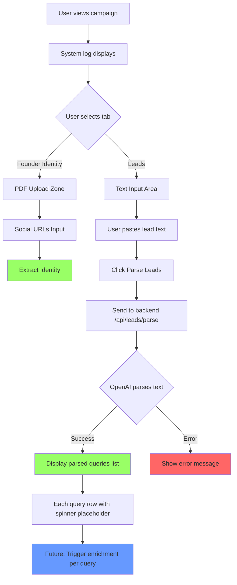

# User Story: Tabbed Interface with Leads Input

**Story ID**: GTM-1
**Created**: 2026-01-31

## User Persona

A startup founder using VibeGTM to enrich their existing lead list before outbound outreach.

## Feature Statement

As a startup founder,
I want to paste my lead list in any format (CSV, bullet points, plain text) and have it automatically parsed into searchable queries
so that I can quickly prepare my leads for enrichment without manual formatting.

## Flow Diagram



## Narrative

### Feature Overview

This feature reorganizes the main campaign view by introducing a tabbed interface below the system_log.sh terminal. The two tabs separate the core VibeGTM workflows:

1. **Founder Identity Tab** - Consolidates the existing identity extraction functionality (PDF upload via Reducto) with social URL inputs into a single cohesive section
2. **Leads Tab** - Introduces a new freeform text input for lead list upload with AI-powered parsing

### Tab Design

The tabs follow the cyberpunk terminal aesthetic established in the codebase:
- Terminal-style tab headers (like browser tabs in a CLI file manager)
- Active tab indicated with neon cyan highlighting and underline
- Inactive tabs dimmed with hover effects
- Tabs labeled: `founder_identity.sh` and `leads.sh` to match terminal naming convention

### Founder Identity Tab

Contains the existing functionality, reorganized:
- **CyberFileDropZone** - PDF drag-and-drop upload for CV/company docs
- **CyberProfileCard** - Displays extracted identity after processing
- **CyberSocialUrlsInput** - Six social media URL fields (LinkedIn, Twitter, GitHub, Instagram, Facebook, Website)

This consolidates what was previously split across two columns into one unified identity section.

### Leads Tab

Introduces new lead parsing functionality:

**Input Area:**
- Large text area with terminal styling (monospace font, dark background)
- Placeholder text showing example formats:
  ```
  Paste your leads in any format:
  - Joshua Alphonse - Mux Community Engineer
  - Ernie Ho, Namecard.ai CEO
  John Smith Acme Corp
  jane@company.com, Jane Doe, Product Manager
  ```
- "Parse Leads" button styled as terminal command button

**Parsing Logic (Backend):**
- Accepts raw text in any format (CSV, bullet lists, comma-separated, newlines)
- Uses OpenAI to intelligently parse and extract individual lead queries
- Cleans special characters (CSV separators, bullets, dashes, dots)
- Returns array of clean search queries

**Query Display:**
- List of parsed queries displayed in terminal-style rows
- Each row shows the extracted query text
- Spinner placeholder on each row (for future enrichment loading state)
- Row styling matches system log aesthetic

### Business Rules

1. **Input Flexibility**: Accept any text format - the AI handles normalization
2. **Query Cleanup**: Remove list markers (-, *, •, numbers), CSV separators, excessive whitespace
3. **Deduplication**: Identical queries should be merged
4. **Empty Handling**: Skip empty lines and whitespace-only entries
5. **Character Limit**: Text area limited to 10,000 characters (reasonable for 1-10 leads)

### Edge Cases

- **Empty Input**: Disable parse button, show validation message
- **Single Lead**: Should work with just one line of text
- **Malformed Input**: AI should extract what it can, skip gibberish
- **API Failure**: Show error message in terminal style, allow retry

## Non-functional Requirements

### Loading & Feedback

- Tab switching should be instant (client-side state change)
- Parse button shows loading state while API request is in flight
- Parsed queries appear progressively if possible, or all at once with fade-in animation
- Each query row has a spinner placeholder (not animated until enrichment feature added)

### Error Handling

- OpenAI API errors display user-friendly message: `> ERROR: Failed to parse leads. Retry?`
- Network errors show connection failure message
- Invalid/unparseable text returns empty list with message: `> No leads detected in input`

### Reliability

- Tab state persists during session (not across page reloads for MVP)
- Parsed leads stored in component state (not persisted to backend for now)
- Text input preserved when switching tabs within same session

## Acceptance Criteria

### Scenario: User views the tabbed interface

```gherkin
Given I am viewing a campaign
When the page loads
Then I should see system_log.sh terminal at the top
And I should see two tabs below it: "founder_identity.sh" and "leads.sh"
And the "founder_identity.sh" tab should be active by default
```

### Scenario: User switches to Leads tab

```gherkin
Given I am on the Founder Identity tab
When I click on the "leads.sh" tab
Then the Leads tab should become active
And I should see a text area for pasting leads
And I should see a "Parse Leads" button
```

### Scenario: User switches to Founder Identity tab

```gherkin
Given I am on the Leads tab
When I click on the "founder_identity.sh" tab
Then the Founder Identity tab should become active
And I should see the PDF upload zone
And I should see the social URLs input fields
```

### Scenario: User pastes bullet-point lead list

```gherkin
Given I am on the Leads tab
When I paste the following text:
  """
  - Joshua Alphonse - Mux Community Engineer
  - Ernie Ho - Namecard.ai CEO
  - Joe Schwarzmann - Robby Co-Founder
  """
And I click "Parse Leads"
Then I should see a loading indicator
And the backend should receive the raw text
And I should see a list of 3 parsed queries
And each query should be cleaned (no bullet points or dashes as separators)
```

### Scenario: User pastes CSV-style lead list

```gherkin
Given I am on the Leads tab
When I paste the following text:
  """
  Jakub Sobolewski, Accenture
  Anas Farhan, Some Company
  """
And I click "Parse Leads"
Then I should see 2 parsed queries
And the queries should not contain comma separators
```

### Scenario: User pastes mixed format lead list

```gherkin
Given I am on the Leads tab
When I paste the following text:
  """
  1. John Smith - CEO at TechCorp
  Jane Doe, Product Manager, Startup Inc
  • Mike Johnson Acme
  """
And I click "Parse Leads"
Then I should see 3 parsed queries
And all formatting artifacts should be removed
```

### Scenario: User submits empty input

```gherkin
Given I am on the Leads tab
And the text area is empty
Then the "Parse Leads" button should be disabled
```

### Scenario: Parsing fails due to API error

```gherkin
Given I am on the Leads tab
And I have entered valid lead text
When I click "Parse Leads"
And the backend API returns an error
Then I should see an error message in terminal style
And the text input should be preserved
And I should be able to retry
```

### Scenario: User views parsed queries list

```gherkin
Given I have successfully parsed leads
Then I should see each query in a terminal-styled row
And each row should have a spinner icon (not animated, placeholder for future)
And the queries should be displayed in order
```

### Scenario: Tab state persists during session

```gherkin
Given I am on the Leads tab
And I have entered some text in the input
When I switch to the Founder Identity tab
And I switch back to the Leads tab
Then my previously entered text should still be there
```

## API Specification

### POST /api/leads/parse

**Request:**
```json
{
  "raw_text": "- Joshua Alphonse - Mux\n- Ernie Ho - Namecard.ai"
}
```

**Response (Success):**
```json
{
  "queries": [
    "Joshua Alphonse Mux",
    "Ernie Ho Namecard.ai"
  ]
}
```

**Response (Error):**
```json
{
  "detail": "Failed to parse leads"
}
```

## Technical Notes

- Backend uses existing OpenAI configuration from `config.py`
- Frontend tabs implemented as controlled component with React state
- Parsed queries stored in CampaignContext or local component state
- Future enrichment will call `/api/leads/enrich/{query}` for each query in parallel
