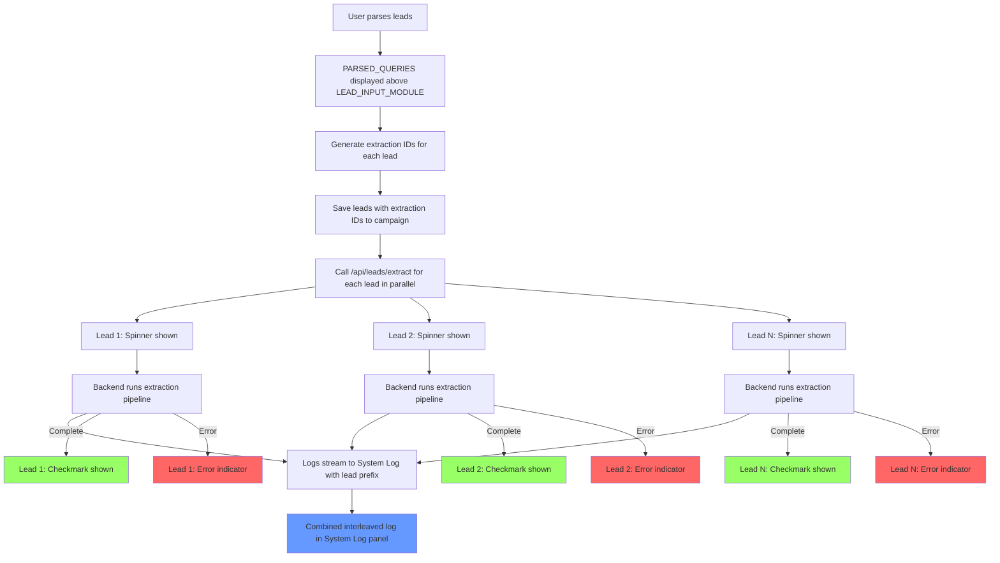

# User Story: Parallel Lead Extraction Processing

**Story ID**: GTM-3
**Created**: 2026-01-31

## User Persona

A startup founder using VibeGTM who has parsed their lead list and wants to immediately start enriching each lead to discover technical and personal fit signals.

## Feature Statement

As a startup founder,
I want my parsed leads to automatically start enriching in parallel with real-time status feedback
so that I can see progress for each lead and get results faster without manual intervention.

## Flow Diagram



## Narrative

### Feature Overview

This feature completes the lead enrichment pipeline by connecting the parsed leads from GTM-2 to the extraction pipeline infrastructure already built for founder identity extraction. After parsing leads, the system immediately begins enriching each lead in parallel, showing individual progress indicators and streaming logs to the existing System Log panel.

### UI Layout Changes

**PARSED_QUERIES above LEAD_INPUT_MODULE:**
The PARSED_QUERIES section moves above the text input area. This provides a logical flow:
1. User sees their parsed leads at the top
2. Input area below allows adding more leads
3. Each parsed lead shows its extraction status inline

**Lead Row Status Indicators:**
Each lead in PARSED_QUERIES displays one of three states:
- **Spinner**: Extraction in progress (animated)
- **Checkmark**: Extraction completed successfully
- **Error icon**: Extraction failed (with hover tooltip for error message)

### Extraction ID Generation

Before starting extractions, the frontend generates a unique extraction ID for each lead. This ID is:
1. Generated client-side using a UUID or similar unique identifier
2. Stored in the campaign's leads array along with the query text
3. Passed to the backend when starting extraction
4. Used by the backend as the `extraction_id` when saving to the `extractions` collection

This approach ensures the frontend can track which extraction results belong to which lead, enabling real-time status updates.

### Lead Data Model Update

Campaign leads evolve from simple strings to objects:
```typescript
interface Lead {
  id: string           // Unique ID for this lead
  query: string        // The parsed search query
  extractionId: string // Pre-generated ID for extraction result
  status: 'pending' | 'processing' | 'completed' | 'error'
  error?: string       // Error message if failed
}
```

### Backend Endpoint

**POST /api/leads/extract**

A new endpoint that starts extraction for a single lead:
- Accepts: `campaign_id`, `extraction_id`, `query`
- Creates an extraction task with the provided `extraction_id`
- Runs `run_extraction_pipeline` in background
- Pipeline uses the provided `extraction_id` when saving results
- Returns immediately with `task_id` for SSE streaming

### Parallel Processing

When leads are parsed:
1. Frontend generates extraction IDs for all new leads
2. Frontend saves leads with IDs to campaign via existing API
3. Frontend calls `/api/leads/extract` for each lead concurrently
4. Each extraction runs independently in parallel
5. Multiple SSE streams feed logs to the combined System Log

### System Log Integration

The existing `ExtractionLogStream` component receives logs from all parallel extractions:
- Logs are prefixed with lead identifier: `[Lead 01]`, `[Lead 02]`, etc.
- All logs interleave in chronological order
- Progress bars could show combined progress or most active extraction
- Terminal header updates to show: `leads_extraction.sh` during lead processing

### Auto-Processing New Leads

When user adds more leads while extractions are running:
1. New leads are parsed and appended to the list
2. New extraction IDs are generated
3. New extractions start immediately in parallel
4. Existing extractions continue unaffected
5. New logs interleave with ongoing extraction logs

### Business Rules

1. **Immediate Start**: Extractions begin automatically after parsing - no manual trigger needed
2. **Parallel Execution**: All leads process concurrently (no queue/sequential processing)
3. **Pre-generated IDs**: Extraction IDs are generated before API call to ensure consistency
4. **Persistent Status**: Lead status persists in campaign data for later retrieval
5. **Graceful Failures**: Individual lead failures don't affect other extractions
6. **Log Prefixing**: Each log entry includes lead identifier for traceability

### Edge Cases

- **No leads parsed**: Don't start any extractions, show empty state
- **Single lead**: Works identically to multi-lead case
- **All extractions fail**: Each shows error state independently
- **Campaign switch during processing**: Extractions continue in background, logs reconnect when viewing that campaign
- **Network disconnect**: SSE reconnects, catches up with existing logs

## Non-functional Requirements

### Loading & Feedback

- Individual spinners animate smoothly next to each processing lead
- Status transitions (pending → processing → completed/error) should feel instant
- System Log auto-scrolls to show latest entries
- Lead list should not flicker or re-render unnecessarily during status updates

### Error Handling

- Failed extractions show red error indicator with tooltip showing the error message
- Network errors during SSE show reconnection message in System Log
- Partial failures are clearly distinguishable from full failures

### Reliability

- Extraction IDs are persisted before starting extraction to survive page refresh
- SSE reconnection resumes from where connection dropped
- Backend extraction continues even if frontend disconnects

## Acceptance Criteria

### Scenario: PARSED_QUERIES appears above LEAD_INPUT_MODULE

```gherkin
Given I am on the Leads tab
When I have parsed leads
Then I should see PARSED_QUERIES section above the text input area
And the LEAD_INPUT_MODULE should be below the parsed leads list
```

### Scenario: Extractions start automatically after parsing

```gherkin
Given I am on the Leads tab
And I have entered lead text
When I click "Parse Leads"
And the leads are successfully parsed
Then each lead should immediately show a spinner indicator
And the System Log should show extraction starting
And I should not need to click any additional buttons
```

### Scenario: Each lead shows individual progress spinner

```gherkin
Given I have 3 leads processing
Then each lead row should display its own spinner
And the spinners should animate independently
And completed leads should show checkmarks while others still process
```

### Scenario: System Log shows interleaved logs from all extractions

```gherkin
Given I have 3 leads processing in parallel
When extractions generate log messages
Then the System Log should show all messages interleaved
And each message should be prefixed with its lead identifier
And messages should appear in chronological order
```

### Scenario: Lead extraction completes successfully

```gherkin
Given a lead is being extracted
When the extraction pipeline completes
Then the spinner should change to a green checkmark
And the System Log should show completion message
And the lead's extraction ID should be saved in campaign data
```

### Scenario: Lead extraction fails

```gherkin
Given a lead is being extracted
When the extraction pipeline fails with error "Rate limit exceeded"
Then the spinner should change to a red error indicator
And hovering over the error should show "Rate limit exceeded"
And other leads should continue processing unaffected
```

### Scenario: Adding more leads during active extraction

```gherkin
Given I have 2 leads currently processing
When I paste additional lead text
And I click "Parse Leads"
Then the new leads should be added to the list
And new extractions should start immediately for the new leads
And existing extractions should continue unaffected
And new logs should appear interleaved with existing logs
```

### Scenario: Campaign stores leads with extraction IDs

```gherkin
Given I have parsed leads
When extractions are started
Then the campaign should be updated with lead objects containing:
  | id | query | extractionId | status |
And the extractionId should match the ID used in extractions collection
```

### Scenario: Extraction ID provided to backend

```gherkin
Given I start extraction for a lead with extractionId "abc123"
When the backend saves extraction results
Then the document in extractions collection should have _id "abc123"
And I can later query this extraction by the known ID
```

### Scenario: Viewing completed extractions after page refresh

```gherkin
Given I had extractions complete for a campaign
When I refresh the page
And I navigate to that campaign
Then I should see leads with their completion status
And completed leads should show checkmarks (not spinners)
```

## API Specification

### POST /api/leads/extract

Starts extraction for a single lead with a pre-generated extraction ID.

**Request:**
```json
{
  "campaign_id": "abc123",
  "extraction_id": "ext_def456",
  "query": "Joshua Alphonse Mux Community Engineer"
}
```

**Response (Success):**
```json
{
  "task_id": "task_789",
  "extraction_id": "ext_def456"
}
```

**Response (Error - Campaign not found):**
```json
{
  "detail": "Campaign not found"
}
```

### Modified: run_extraction_pipeline

The pipeline function needs to accept an optional `extraction_id` parameter:
- If provided, use this ID when saving to `extractions` collection
- If not provided, generate one (backward compatible with identity extraction)

### SSE Stream: GET /api/extraction/stream/{task_id}

Existing endpoint, no changes needed. Frontend opens multiple streams for parallel extractions.

## Technical Notes

### Frontend Changes

1. **CyberLeadsInput.tsx**: Reorder sections (PARSED_QUERIES above input)
2. **Lead type**: Update from `string[]` to `Lead[]` interface
3. **CampaignContext**: Update `updateLeads` to handle new Lead structure
4. **New hook**: `useLeadExtractions` to manage multiple parallel extraction streams
5. **ExtractionLogStream**: Accept logs from multiple sources, add lead prefix

### Backend Changes

1. **New endpoint**: `POST /api/leads/extract` in new router `routers/leads_extraction.py`
2. **pipeline_async.py**: Accept optional `extraction_id` parameter
3. **Campaign service**: Update lead storage to support Lead objects

### Database Changes

Campaign document structure update:
```json
{
  "leads": [
    {
      "id": "lead_001",
      "query": "Joshua Alphonse Mux",
      "extractionId": "ext_abc123",
      "status": "completed"
    }
  ]
}
```

### ID Generation Strategy

Frontend generates extraction IDs using format: `ext_{uuid.slice(0,8)}`
This ensures:
- IDs are unique across all extractions
- Frontend knows the ID before backend response
- Campaign can store the ID immediately
- Extraction results can be queried by known ID
