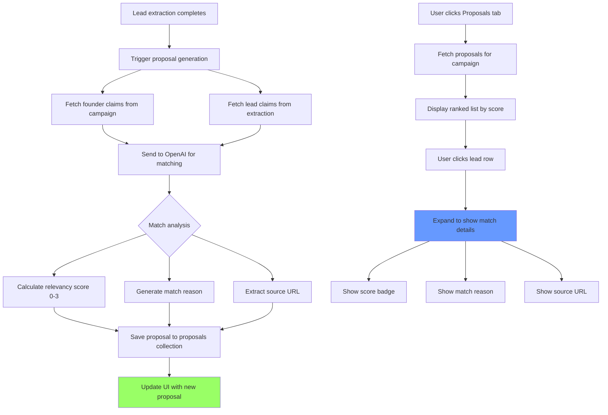

# User Story: Matching Proposals Tab

**Story ID**: GTM-4
**Created**: 2026-01-31

## User Persona

A startup founder using VibeGTM who has extracted lead data and wants to see AI-generated match proposals showing why each lead is relevant based on shared interests, experiences, and fit.

## Feature Statement

As a startup founder,
I want to see AI-scored proposals for each extracted lead showing why we match and where the match was found
so that I can prioritize which leads to contact first and have ready-made conversation starters for personalized outreach.

## Flow Diagram



## Narrative

### Feature Overview

This feature adds a third tab "Proposals" alongside the existing "Founder Identity" and "Leads" tabs. When a lead's extraction completes (from GTM-3), the system automatically analyzes the founder's claims against the lead's extracted claims using OpenAI, generating a relevancy score and match reason. These proposals are stored in a `proposals/{campaignId}` collection and displayed in a terminal-style expandable list.

### Tab Integration

A new tab is added to the existing tabbed interface:
- `founder_identity.sh` - Existing founder profile extraction
- `leads.sh` - Existing lead list parsing and extraction
- `proposals.sh` - **NEW** Ranked list of matched proposals

The tab follows the same cyberpunk terminal aesthetic with neon cyan highlighting for the active state.

### Proposal Data Model

Each proposal contains:
```typescript
interface Proposal {
  id: string                    // Unique proposal ID
  campaignId: string            // Parent campaign
  leadId: string                // Reference to the lead
  extractionId: string          // Reference to lead's extraction
  leadName: string              // Lead's name for display
  score: 0 | 1 | 2 | 3          // 0=None, 1=Low, 2=Medium, 3=Perfect
  scoreLabel: 'None' | 'Low' | 'Medium' | 'Perfect'
  reason: string                // Why there's a match (e.g., "Both ride Harleys")
  sourceUrl: string             // URL where the match was found
  sourceReadable: string        // Human-readable source (e.g., "Medium", "LinkedIn")
  createdAt: datetime
}
```

### Scoring System

The relevancy score uses a 0-3 categorical scale:
- **3 (Perfect)**: Strong personal or technical overlap with clear conversation potential
- **2 (Medium)**: Meaningful shared interest or experience worth mentioning
- **1 (Low)**: Tenuous connection that might help, but isn't compelling
- **0 (None)**: No relevant overlap found between founder and lead

### Automatic Generation Flow

1. GTM-3's extraction pipeline completes for a lead
2. System triggers proposal generation automatically
3. Backend fetches:
   - Founder's claims from campaign's identity extraction
   - Lead's claims from the completed extraction
4. OpenAI analyzes both claim sets using structured output
5. Returns: score, reason, and source URL
6. Proposal is saved to `proposals` collection
7. Frontend receives update via SSE or polling

### OpenAI Matching Prompt Strategy

The matching prompt is designed for future email personalization:

```
Analyze these two people's profiles and find the most compelling match for outreach.

FOUNDER CLAIMS:
{founder claims with URLs}

LEAD CLAIMS:
{lead claims with URLs}

Find connections that would make a great conversation starter, such as:
- Shared hobbies (both ride motorcycles, play tennis, love hiking)
- Common experiences (same school, previous employer, lived in same city)
- Mutual interests (AI, startup culture, specific technologies)
- Cultural/community overlap (same communities, events, causes)

The match reason should be conversational, suitable for use in an email opener like:
"I noticed you also ride Harleys - I saw your post on Medium about the cross-country trip."

Return the single best match with the source URL where you found the lead's claim.
```

### UI Design: Proposals Tab

**List View (Collapsed State):**
```
┌─────────────────────────────────────────────────────────────┐
│ proposals.sh                                                 │
├─────────────────────────────────────────────────────────────┤
│ ▸ Joshua Alphonse                    [PERFECT]  ████████████│
│ ▸ Ernie Ho                           [MEDIUM]   ████████░░░░│
│ ▸ Joe Schwarzmann                    [LOW]      ████░░░░░░░░│
│ ▸ Jane Doe                           [NONE]     ░░░░░░░░░░░░│
└─────────────────────────────────────────────────────────────┘
```

**Expanded Row (After Click):**
```
┌─────────────────────────────────────────────────────────────┐
│ ▾ Joshua Alphonse                    [PERFECT]  ████████████│
│   ┌─────────────────────────────────────────────────────────│
│   │ > MATCH: You both ride Harleys and have done cross-    │
│   │          country trips on motorcycles                   │
│   │ > SOURCE: Medium (medium.com/@jalphonse/my-harley...)  │
│   └─────────────────────────────────────────────────────────│
│ ▸ Ernie Ho                           [MEDIUM]   ████████████│
└─────────────────────────────────────────────────────────────┘
```

**Score Badge Colors:**
- **Perfect (3)**: Neon green (`#39ff14`)
- **Medium (2)**: Amber (`#ffb800`)
- **Low (1)**: Dimmed cyan (`#00fff580`)
- **None (0)**: Gray (`#4a5568`)

### Backend Storage

Proposals are stored in a dedicated collection: `proposals`

Document structure:
```json
{
  "_id": "prop_abc123",
  "campaign_id": "camp_xyz",
  "lead_id": "lead_001",
  "extraction_id": "ext_def456",
  "lead_name": "Joshua Alphonse",
  "score": 3,
  "score_label": "Perfect",
  "reason": "You both ride Harleys and have done cross-country trips on motorcycles",
  "source_url": "https://medium.com/@jalphonse/my-harley-adventure",
  "source_readable": "Medium",
  "founder_claim": "Rides a Harley Davidson, completed Route 66 trip",
  "lead_claim": "Documented cross-country motorcycle journey on Harley",
  "created_at": "2026-01-31T10:30:00Z"
}
```

### Business Rules

1. **Automatic Triggering**: Proposal generation starts automatically when extraction completes
2. **One Proposal Per Lead**: Each lead gets exactly one proposal per campaign
3. **Sorted by Score**: Proposals list is always sorted by score (Perfect first, None last)
4. **Requires Both Profiles**: Cannot generate proposal if founder identity hasn't been extracted
5. **Graceful Degradation**: If no match found, still create proposal with score=0 and generic reason
6. **Source Attribution**: Always include the URL where the lead's matching claim was found

### Edge Cases

- **No founder identity**: Show message "Extract founder identity first to generate proposals"
- **Lead extraction failed**: Skip proposal generation, show error state in list
- **No matches found**: Create proposal with score=0, reason="No shared interests found"
- **OpenAI failure**: Retry once, then mark proposal as failed with error message
- **Campaign switch**: Load proposals for the selected campaign

## Non-functional Requirements

### Loading & Feedback

- Proposal generation should complete within a few seconds of extraction finishing
- List should show "Generating proposal..." placeholder while processing
- Score badges should have subtle glow animation on Perfect matches
- Expanding/collapsing rows should be instant

### Error Handling

- Failed proposal generation shows error state with retry option
- Network errors during list fetch show reconnection message
- Clear indication when founder identity is missing

### Reliability

- Proposals persist in database and survive page refresh
- Incomplete proposals (mid-generation) show pending state on reload
- Duplicate proposals prevented by lead_id + campaign_id uniqueness

## Acceptance Criteria

### Scenario: Proposals tab appears in tabbed interface

```gherkin
Given I am viewing a campaign
When I look at the tab bar below the system log
Then I should see three tabs: "founder_identity.sh", "leads.sh", and "proposals.sh"
And I should be able to switch between all three tabs
```

### Scenario: Proposal auto-generates after lead extraction

```gherkin
Given I have extracted my founder identity
And a lead extraction just completed
When the extraction finishes successfully
Then the system should automatically start generating a proposal
And I should see "Generating proposal..." for that lead in the Proposals tab
And when complete, I should see the score badge and match reason
```

### Scenario: User views proposals list sorted by score

```gherkin
Given I have multiple proposals generated
When I click on the "proposals.sh" tab
Then I should see a list of all leads with proposals
And the list should be sorted by score (Perfect first, None last)
And each row should show the lead name and score badge
```

### Scenario: User expands a proposal to see details

```gherkin
Given I am on the Proposals tab
And I see a list of proposals
When I click on a lead row
Then the row should expand to show:
  | Match reason (conversational text) |
  | Source URL with readable name |
And clicking again should collapse the row
```

### Scenario: Score badges display correct colors

```gherkin
Given I am viewing the proposals list
Then proposals with score 3 should show [PERFECT] badge in neon green
And proposals with score 2 should show [MEDIUM] badge in amber
And proposals with score 1 should show [LOW] badge in dimmed cyan
And proposals with score 0 should show [NONE] badge in gray
```

### Scenario: No founder identity extracted

```gherkin
Given I have not extracted my founder identity
When I navigate to the Proposals tab
Then I should see a message: "Extract founder identity first to generate proposals"
And no proposals should be generated even if leads are extracted
```

### Scenario: Lead extraction failed

```gherkin
Given a lead's extraction failed with an error
When I view the Proposals tab
Then that lead should show in the list with an error indicator
And I should not see a proposal for that lead
```

### Scenario: No matching interests found

```gherkin
Given I have founder identity extracted
And a lead's extraction completed
And there are no overlapping interests
When the proposal is generated
Then it should have score 0 (None)
And the reason should indicate no shared interests were found
```

### Scenario: Proposal shows source URL

```gherkin
Given a proposal was generated with a match
When I expand the proposal row
Then I should see the source URL where the match was found
And it should be displayed in human-readable form (e.g., "LinkedIn", "Medium")
And clicking the URL should open it in a new tab
```

### Scenario: Proposals persist after page refresh

```gherkin
Given I have generated proposals for a campaign
When I refresh the page
And I navigate back to that campaign
And I click on the Proposals tab
Then I should see all previously generated proposals
And their scores, reasons, and sources should be intact
```

## API Specification

### POST /api/proposals/generate

Generates a proposal for a single lead. Called automatically after extraction completes.

**Request:**
```json
{
  "campaign_id": "camp_xyz",
  "lead_id": "lead_001",
  "extraction_id": "ext_def456"
}
```

**Response (Success):**
```json
{
  "id": "prop_abc123",
  "lead_name": "Joshua Alphonse",
  "score": 3,
  "score_label": "Perfect",
  "reason": "You both ride Harleys and have done cross-country trips",
  "source_url": "https://medium.com/@jalphonse/my-harley-adventure",
  "source_readable": "Medium"
}
```

**Response (No founder identity):**
```json
{
  "detail": "Founder identity not extracted for this campaign"
}
```

### GET /api/proposals/{campaign_id}

Fetches all proposals for a campaign, sorted by score descending.

**Response:**
```json
{
  "proposals": [
    {
      "id": "prop_abc123",
      "lead_id": "lead_001",
      "lead_name": "Joshua Alphonse",
      "score": 3,
      "score_label": "Perfect",
      "reason": "You both ride Harleys and have done cross-country trips",
      "source_url": "https://medium.com/@jalphonse/...",
      "source_readable": "Medium",
      "created_at": "2026-01-31T10:30:00Z"
    },
    {
      "id": "prop_def456",
      "lead_id": "lead_002",
      "lead_name": "Ernie Ho",
      "score": 2,
      "score_label": "Medium",
      "reason": "Both interested in AI and startup culture",
      "source_url": "https://linkedin.com/in/ernieho/...",
      "source_readable": "LinkedIn",
      "created_at": "2026-01-31T10:31:00Z"
    }
  ]
}
```

## Technical Notes

### Backend Changes

1. **New endpoint**: `POST /api/proposals/generate` in `routers/proposals.py`
2. **New endpoint**: `GET /api/proposals/{campaign_id}`
3. **Matcher update**: Extend `proposal/matcher.py` to support the new scoring system and source extraction
4. **Auto-trigger**: Call proposal generation at the end of `run_extraction_pipeline` for lead extractions
5. **Schema update**: Add `Proposal` model with score enum (0-3) and source fields

### Frontend Changes

1. **New tab**: Add "proposals.sh" tab to `CyberTabNav.tsx`
2. **New component**: `CyberProposals.tsx` - List view with expandable rows
3. **New component**: `CyberProposalRow.tsx` - Individual proposal with expand/collapse
4. **Context update**: Add proposals state to `CampaignContext`
5. **Auto-refresh**: Listen for extraction completion events to trigger proposal fetch

### Database

New collection: `proposals`
- Index on `campaign_id` for fast campaign-scoped queries
- Unique compound index on `campaign_id` + `lead_id` to prevent duplicates
- Index on `score` for sorted retrieval

### OpenAI Integration

Use structured output with the existing pattern from `search_extract/extractor.py`:
```python
class ProposalOutput(BaseModel):
    score: Literal[0, 1, 2, 3]
    score_label: Literal["None", "Low", "Medium", "Perfect"]
    reason: str
    source_url: str
    source_readable: str
    founder_claim_used: str
    lead_claim_used: str
```
